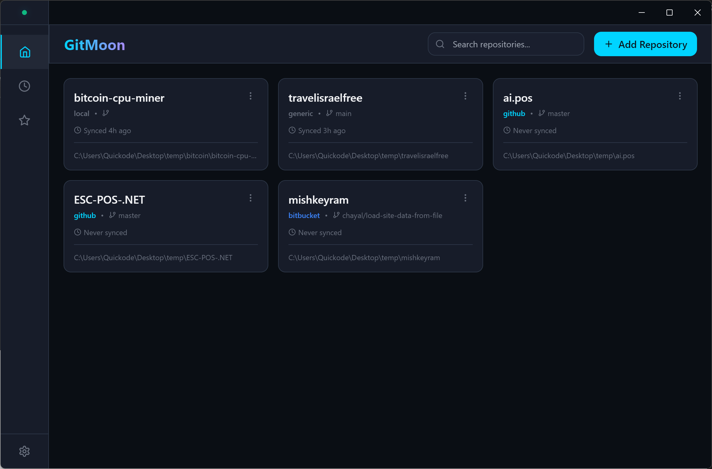
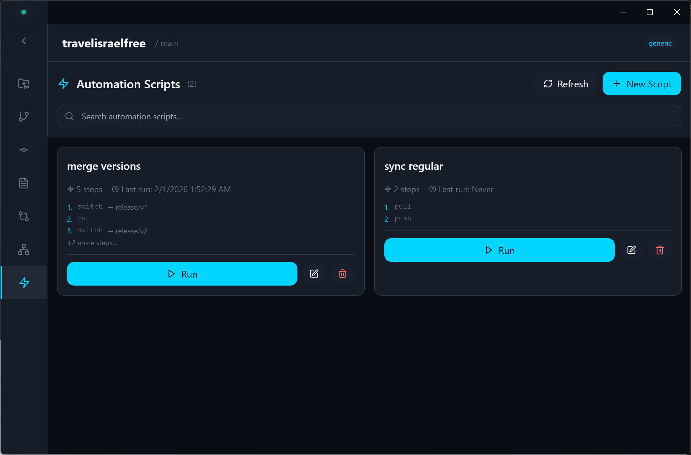
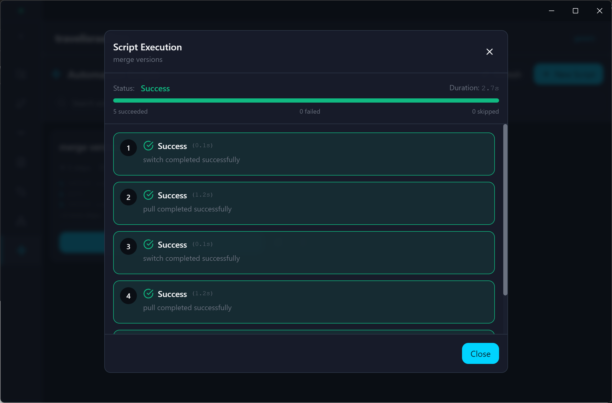
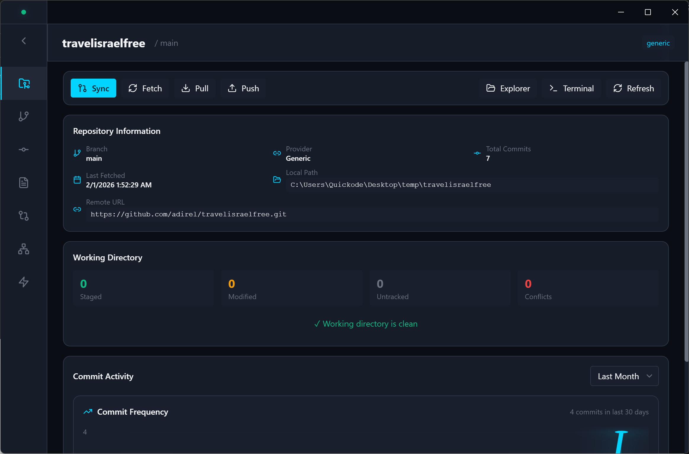

# GitMoon 🌙
  


A desktop Git client that works offline and looks good doing it. combine automation scripts for friendly day to day operations



## What is it?

GitMoon is a Git UI for people who want to manage repositories without always being online. It's built with Electron and React, with a dark futuristic theme that's easy on the eyes.

## Key Features

- **Works offline** - Do everything without an internet connection. Push/pull when you're ready.
- **Branch comparison** - See what changed between branches with file-by-file diffs
- **Commit graph** - Visual representation of your git history
- **Automation scripts** - Create multi-step workflows for common tasks (merge, push, pull, etc.)
- **Clean interface** - Focus on what matters without the clutter



## Automation Scripts

Create custom workflows to automate repetitive git operations. For example:
- Switch to main → pull → switch to feature branch → merge main → push
- Daily sync across multiple branches
- Release preparation workflows



## Getting Started

**Requirements:** Node.js 18+, Git

```bash
# Install dependencies
npm install

# Run in development mode
npm run dev

# Build for production
npm run build
```

## How It Works

GitMoon uses [dugite](https://github.com/desktop/dugite) (the same Git wrapper as GitHub Desktop) to interact with your repositories. Everything is stored locally using electron-store, so your data stays on your machine.



## Tech Stack

- **Electron** - Desktop app framework
- **React 18** - UI with hooks
- **TypeScript** - Type safety
- **Tailwind CSS** - Styling
- **Zustand** - State management
- **Vite** - Fast development builds

## Project Structure

```
src/
├── main/          # Electron main process (git operations)
├── renderer/      # React UI
├── preload/       # IPC bridge
└── shared/        # Types and constants
```

## Contributing

Feel free to open issues or submit PRs. Keep the code clean and follow the existing patterns.

## License

MIT
- Create feature branches from `main`
- Use conventional commits: `feat:`, `fix:`, `docs:`, etc.
- Submit PRs for review

## 🗺️ Roadmap

### Phase 1: Core Functionality (Current)
- [x] Project setup and architecture
- [x] Repository management UI
- [x] Basic git operations (commits, branches)
- [x] Commit history viewer
- [x] Branch comparison
- [x] Diff viewer with Monaco Editor

### Phase 2: Enhanced Features
- [x] Pull request viewing
- [ ] Conflict resolution UI
- [ ] Stash management
- [x] Search and filters
- [ ] Multi-repository tabs

### Phase 3: Advanced Features
- [ ] Plugin system
- [ ] Custom themes
- [ ] Git LFS support
- [ ] Advanced merge strategies
- [ ] Workflow automation

## 🤝 Contributing

Contributions are welcome! Please read our contributing guidelines and code of conduct before submitting PRs.

## 📄 License

MIT License - see LICENSE file for details

## 🙏 Acknowledgments

- Inspired by GitHub Desktop, GitKraken, and Linear
- Built with amazing open-source tools
- UI design influenced by modern dev tools aesthetics

---

Made with ❤️ and futuristic vibes
